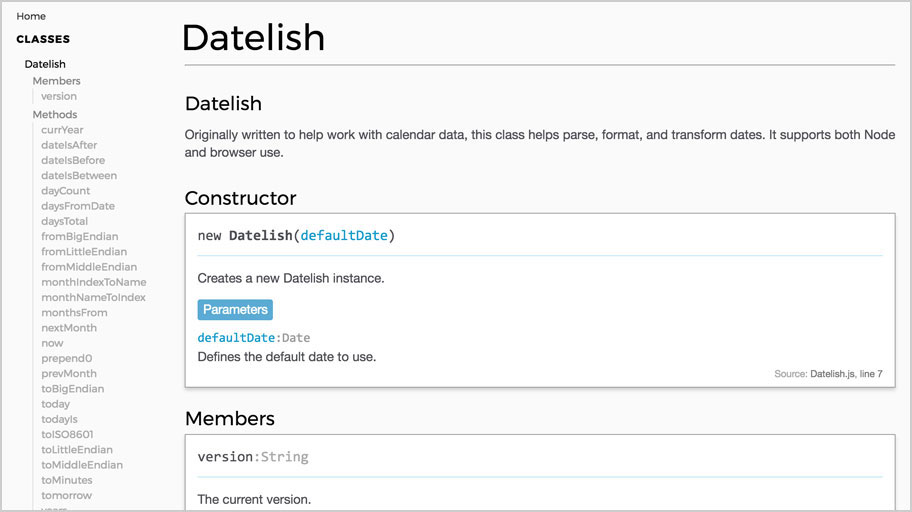
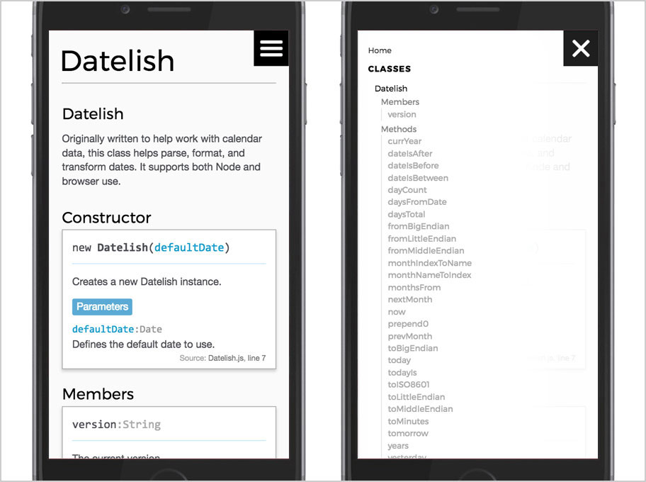

# Boxy JSDoc Template

A clean and streamlined JSDoc 3 template (extended from Minami).





See the template in action [here](http://grafluxe.com/o/doc/datelish/Datelish.html) and [here](http://grafluxe.com/o/doc/email-validator-pro/EmailValidatorPro.html).

## Extends

- [Minami](https://github.com/nijikokun/minami) JSDoc theme

## Uses

- The [Taffy Database library](http://taffydb.com/)
- [Montserrat](https://fonts.google.com/specimen/Montserrat) & Helvetica Neue

## Install

```
$ npm install --save-dev boxy-jsdoc-template
```

## Usage

Clone repository to your designated `jsdoc` template directory, then:

```
$ jsdoc entry-file.js -t path/to/boxy-jsdoc-template
```

### Via Node

`npm i boxy-jsdoc-template -D`

In your projects `package.json` file, add a generate script:

```
"script": {
  "doc": "jsdoc -c .jsdocrc"
}
```

In your `.jsdocrc` file, add a template option.

```
"opts": {
  "template": "node_modules/boxy-jsdoc-template"
}
```

### Example JSDoc Config

```
{
    "tags": {
        "allowUnknownTags": true,
        "dictionaries": ["jsdoc"]
    },
    "source": {
        "include": ["lib", "package.json", "README.md"],
        "includePattern": ".js$",
        "excludePattern": "(node_modules/|docs)"
    },
    "plugins": [
        "plugins/markdown"
    ],
    "templates": {
        "cleverLinks": false,
        "monospaceLinks": true,
        "useLongnameInNav": false
    },
    "opts": {
        "destination": "./docs/",
        "encoding": "utf8",
        "private": true,
        "recurse": true,
        "template": "./node_modules/boxy-jsdoc-template"
    }
}
```

Specifying a number for useLongnameInNav it will be the max number of path elements to show in nav (starting from Class).

## Changelog

### v2.0.2
- Bring back README list-item bullets
- Properly style deprecated method/function params

### v2.0.1
- Update 'description' padding

### v2.0.0
- Fix issue where generation date in footer is wrong
- Update styles
- Support @copyright and @license in global objects
- Update padding in 'exception' section

### v1.3.0
- Update properties output
- Update params output
- Remove unneeded CSS

### v1.2.0
- Update header info section
- Move copyright tag to header info section
- Move license tag to header info section
- Update styles for `<pre>` tags.
- Make anchor text bold
- Add bg color to `<pre>` tags
- Add 'break-word' CSS to `<h1>` tags
- Decrease header sizes
- For mobile nav, fix issue with hover state line-height
- Update JSDoc link to open in _blank window

### v1.0.1
- Update 'properties' layout template
- Remove `<table>` and rewrite completely to update the view
- Improve mobile UI
- Improve mobile UX
- Update HTML to validate against W3C standards
- Removed errors and ignored warnings
- Improve source code view.
- Update mobile nav UI
- Add logic to hide mobile nav on list item click
- Remove unused ionicons css
- Move all scripts to bottom of body tag
- Update js
- Add list of members to nav panel
- Add Members/Methods labels
- Update home/readme styles
- Remove unused static fonts
- Improve mobile layout
- Add author and license info to header.
- Update generation date format
- Remove extra whitespace in param defaults
- Move source link to bottom of output stack.
- Big layout redesign changes
- Refactor param output
- Add more obvious deprecation view

## Thanks

Thanks to the author of the [Minami](https://github.com/nijikokun/minami) theme and its contributors. Their theme and README served as a great base to build from.

## License

Licensed under the Apache2 license.
